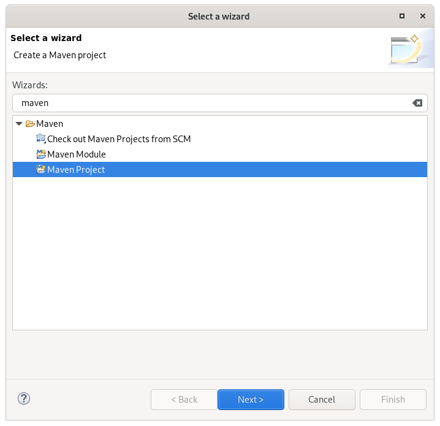
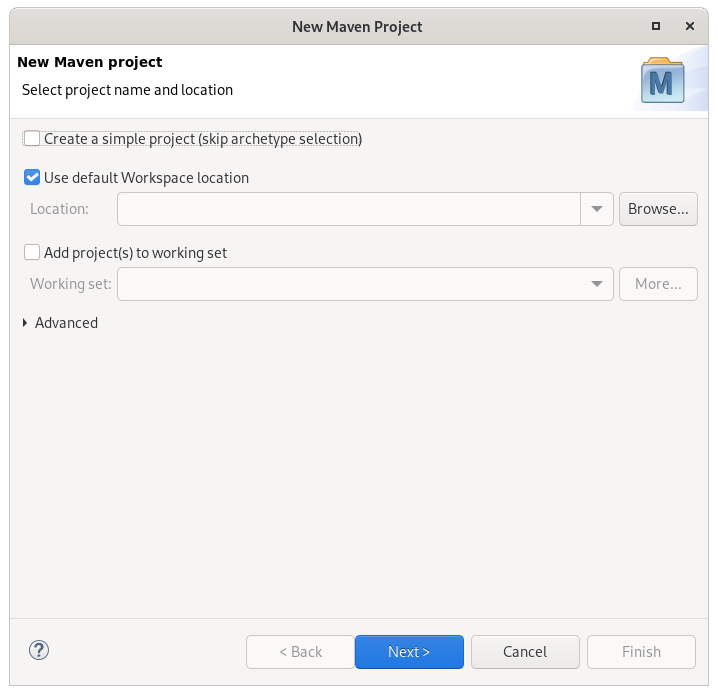

# Spring-MVC-Hello-World-Eclipse
<h2> prerequisites </h2>
<ul>
  <li>Java 11</li>
  <li>Eclipse ide Version: 2021-09 (4.21.0) </li>
  <li>Tomcat 8.5 </li>
</ul>
<h3>Steps fro creating Spring MVC hello World!</h3>

 1) go to new -> project -> Maven Project and click on next

2)You will see bwlow screen, agan click on next

