# Spring-MVC-Hello-World-Eclipse
<h2> prerequisites </h2>

<ul>
  <li>Java 11</li>
  <li>Eclipse ide Version: 2021-09 (4.21.0) </li>
  <li>Tomcat 8.5 </li>
</ul>
<h3>Steps fro creating Spring MVC hello World!</h3>

 1) go to new -> project -> Maven Project and click on next

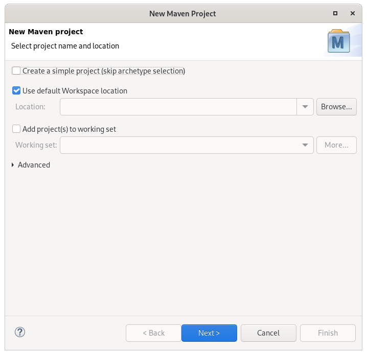

2)You will see bwlow screen, agan click on next

3) We need to select type of archetype here. As we are creating web app here, put following text in filter maven-archetype-webapp 

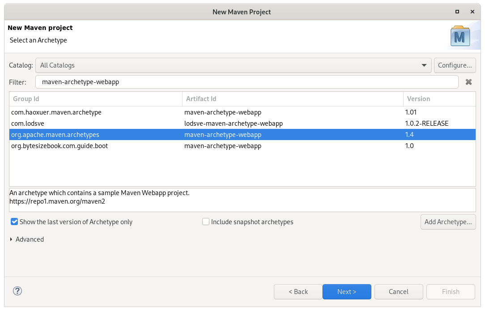

4) We need to put group id and artifact id here.

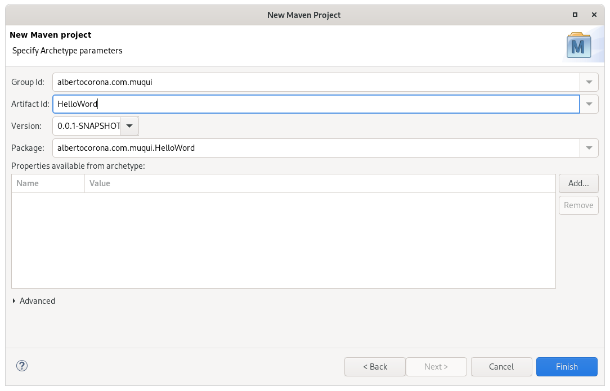

when you follow above steps, ypur project structure will look like below: 

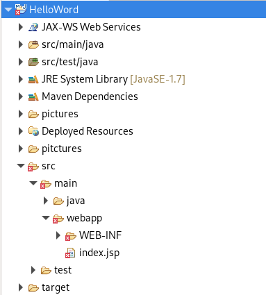

As you can see, we are getting an error (“The superclass “javax.servlet.http.HttpServlet” was found in java build path”) in index.jsp.
To solve this issue, follow below steps:  

 You need to set target run time as Apache Tomcat. To do that, right click on project -> properties -> target runtimes. 

<h3>Adding Spring MVC dependency.</h3>

Add spring dependency in pom.xml. We require spring core and spring mvc dependency here.

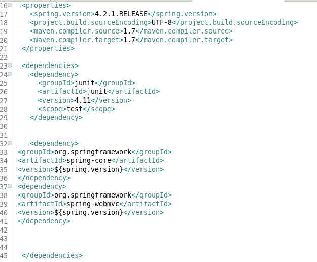
<h3>Create controller and view</h3>

Create a package named "albertoangel.muqui.controller"

createa a controller class named "HelloController"

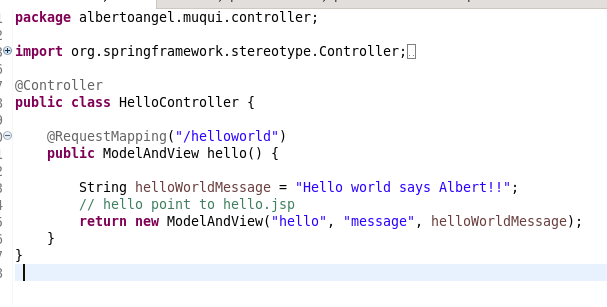

Modify index.jsp as below

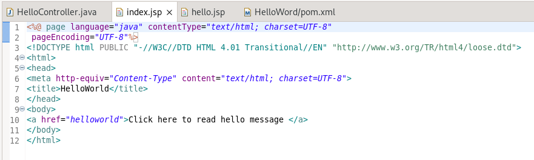

Create hello.jsp in  /WEB-INF/ folder

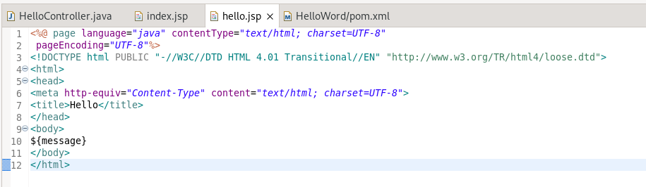

Configuring spring MVC application

We need to configurate two files  "web.xml" and "springmvc-dispatcher-servlet.xml". 

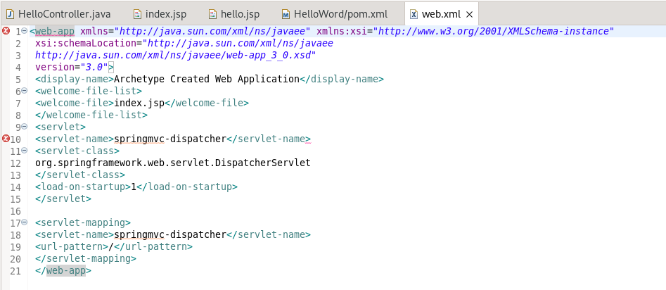

create xml file named “springmvc-dispatcher-servlet.xml” in /WEB-INF folder as below.

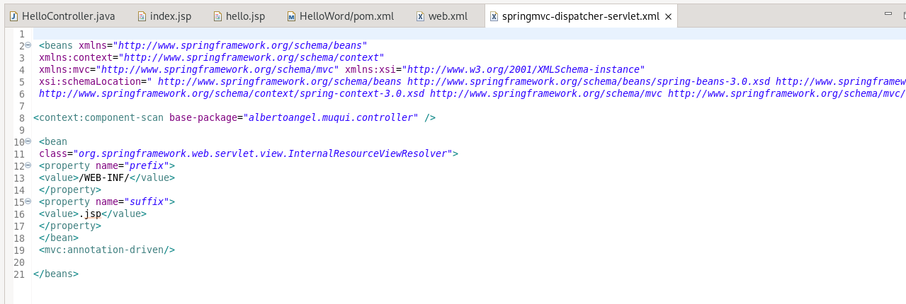

 We do maven  built

 Right click on project -> Run as -> Maven build 

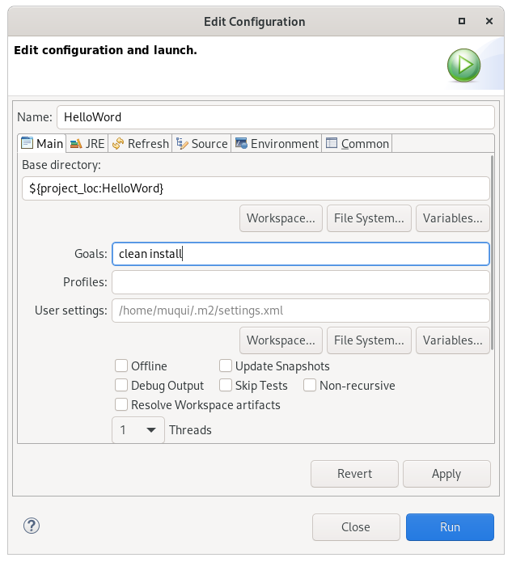
<h3>Run the application</h3>

Right click on project -> run as -> run on server

Select apache tomcat and click on finish

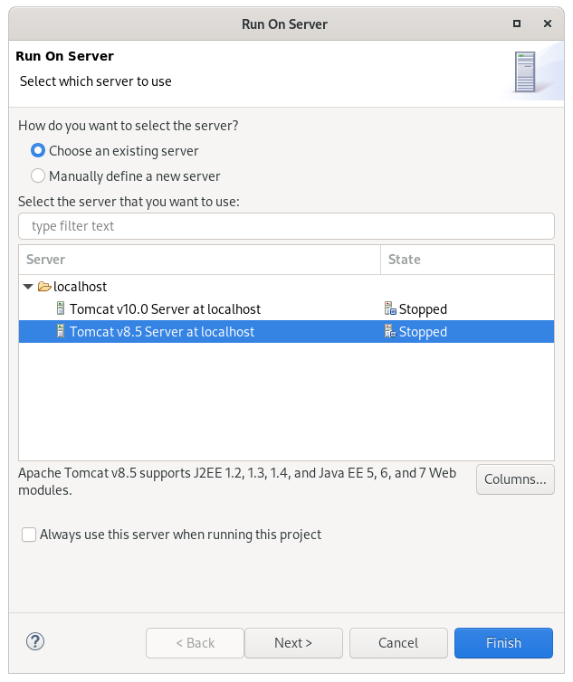
<h3>You will see below screen:</h3>

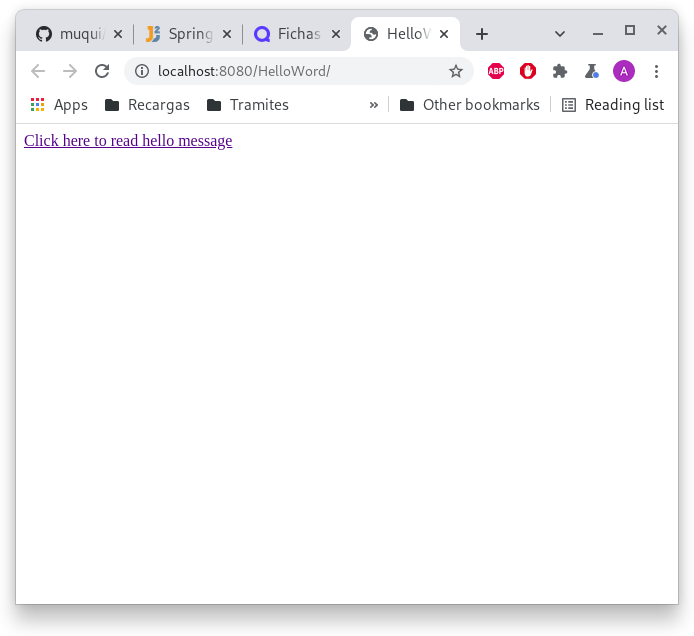

When you click on above link, you will get below screen

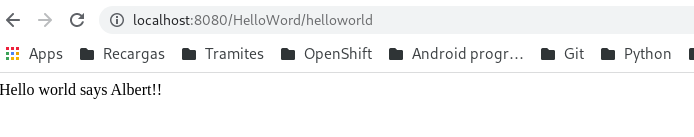

